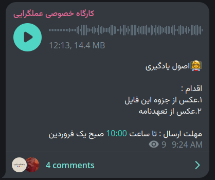

## Lecture 00: Intro

### Content

- [How to be more effective (4:14)](https://t.me/c/2539989892/4)

### Notes

- Assigments usually have less than 1 day.
- Principles?
    - Send an introduction voice
        - ASL
        - Vision
        - Your interests
        - Where you are
        - Where you are going
        - Include First Name, Last Name, and number.
    - Be active in the group
        - Make each other accontable
        - Know each other

### Assigment 

We were asked to send an introduction voice.

Include First Name, Last Name, and number.

## Lecture 01: Learning Basics

### Content

- [Learing Basics (12:13)](https://t.me/c/2539989892/5)

### Notes

- Todo

### Assigment 

{/*
## Lecture 0X: Title

### Content

### Notes

### Assigment 

*/}