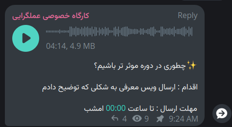

## چطوری در دوره موثرتر باشیم؟ - ۱۴۰۳/۱۲/۳۰

### محتوا

- [چطوری در دوره موثر تر باشیم؟ (4:14)](https://t.me/c/2539989892/4)

### نکات

- تکالیف معمولاً کمتر از ۱ روز زمان دارند.
- اصول؟
    - ارسال صدای معرفی
        - سن، وضعیت زندگی، محل زندگی
        - چشم‌انداز
        - علایق شما
        - الان کجا هستید
        - به کجا می‌خواهید بروید
        - نام، نام خانوادگی و شماره
    - در گروه فعال باشید
        - یکدیگر را پاسخگو نگه دارید
        - همدیگر را بشناسید

### تکلیف

از ما خواسته شد یک ویس معرفی ارسال کنیم.

### تکلیف من

<انجام نشده>